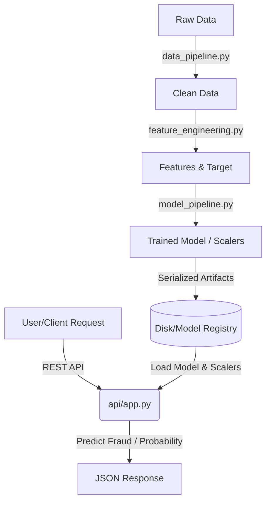

# System Architecture

This document describes the high-level system design, data flow, and modular components of the **End-to-End Fraud Detection System**.

## Architectural Overview

The system is split into two primary pipelines:
1. **Offline Training Pipeline**: Data loading, cleaning, feature engineering, model training, validation, and serialization (saving the model artifact).
2. **Online Inference Pipeline**: REST API accepting real-time transaction inputs, applying feature transformations using the pre-fitted transformer, making inference predictions, and logging transaction decisions.

## Component Breakdown

### 1. Data Pipeline (`src/data_pipeline.py`)
Responsible for raw data ingestion. Since fraud detection often involves imbalanced datasets, this layer includes logic for handling raw datasets, loading them into pandas, validating columns, splitting them into train and test splits, and saving them to the local `data/processed` path.

### 2. Feature Engineering (`src/feature_engineering.py`)
Computes transactional features:
- **Time Features**: Extracts time of day, day of week, and maps them to sine/cosine coordinates (cyclical encoding) for spatial modeling.
- **Categorical Processing**: Encodes categorical values like card-presence and merchant category.
- **Numerical Scaling**: Scales continuous variables like transaction amount using `StandardScaler` to ensure optimal performance of linear/distance-based models.

### 3. Model Pipeline (`src/model_pipeline.py`)
Responsible for instantiating models, training them, calculating robust metrics (ROC AUC, Precision-Recall AUC, F1-Score, and False Positive Rates), and saving/loading the final trained pipeline model.

### 4. REST API Serving (`api/app.py`)
A fast asynchronous FastAPI interface. It validates inputs via Pydantic schemas, performs inference, logs all events using Loguru, and serves predictions in low latency (<50ms).
